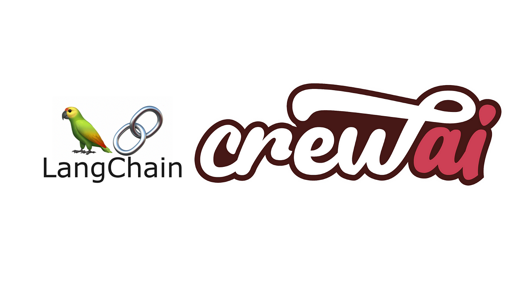

# AI Travel Planner - Azure Function App

<div align="center">

[](https://github.com/joaomdmoura/crewAI)
[](https://github.com/langchain-ai/langchain)
[](https://azure.microsoft.com/en-us/services/functions/)

<p align="center">
  
</p>

_Intelligent Travel Planning with Autonomous AI Agents_

[Quick Start](#prerequisites) •
[Features](#features) •
[Documentation](#how-it-works) •
[Contributing](#contributing)

---

</div>

## Overview

This Azure Function application leverages the power of CrewAI and LangChain to create intelligent travel plans. Built on the concept of autonomous AI agents working together, the system demonstrates the practical application of collaborative AI in travel planning. The system employs three specialized AI agents working in sequence to analyze destinations, provide local insights, and create detailed travel itineraries.

## Features

- 🌍 Intelligent city selection based on weather, events, and costs
- 🎯 Local expert insights and hidden gems recommendations
- 📅 Detailed 7-day itineraries with specific venues and activities
- 💰 Complete budget breakdown and cost analysis
- 🎒 Custom packing suggestions based on weather and activities
- 🏨 Specific hotel and restaurant recommendations

## Technology Stack

### CrewAI Framework

This project is built using [CrewAI](https://github.com/joaomdmoura/crewAI), a cutting-edge framework for orchestrating autonomous AI agents. CrewAI enables:

- 🤖 Creation of specialized AI agents with distinct roles and goals
- 🔄 Sequential task execution with agent collaboration
- 🧠 Intelligent task delegation and process management
- 🔍 Integration with various tools and APIs for enhanced capabilities

### LangChain Integration

The system utilizes [LangChain](https://github.com/langchain-ai/langchain) for:

- 🛠 Tool integration and management
- 🔎 Advanced search capabilities through SerperDev
- 🧩 Structured output parsing and formatting
- 📝 Enhanced text generation and processing

## How It Works

The application combines CrewAI's agent orchestration with LangChain's tools to create a sophisticated travel planning system:

1. **Agent Creation**

```python
from crewai import Agent
from crewai_tools import SerperDevTool

agent = Agent(
    role="City Selection Expert",
    backstory="An expert in analyzing travel data...",
    goal="Select the best city based on criteria...",
    tools=[SerperDevTool()]
)
```

2. **Task Definition**

```python
from crewai import Task

task = Task(
    description="Analyze and select the best city...",
    agent=city_selection_expert
)
```

3. **Crew Orchestration**

```python
from crewai import Crew

crew = Crew(
    agents=[agent1, agent2, agent3],
    tasks=[task1, task2, task3],
    process="sequential"
)
```

[Previous sections remain the same: Features, AI Agents, Prerequisites...]

## Advanced Configuration

### CrewAI Settings

Customize the crew's behavior in `travel_planner.py`:

```python
crew = Crew(
    agents=[...],
    tasks=[...],
    process="sequential",  # or "hierarchical"
    verbose=True,         # Enable detailed logging
    memory=False,         # Disable memory for fresh starts
    cache=True,          # Enable response caching
    max_rpm=1000         # Rate limiting
)
```

### LangChain Tool Integration

Add or modify tools in the agent configuration:

```python
from langchain.tools import Tool
from crewai_tools import SerperDevTool

# Create custom tools
custom_tool = Tool(
    name="Custom Search",
    description="...",
    func=your_custom_function
)

# Add tools to agents
agent = Agent(
    role="Expert",
    tools=[SerperDevTool(), custom_tool]
)
```

## Development Tips

### Working with CrewAI

1. **Agent Design**

   - Define clear, specific roles for each agent
   - Set realistic goals and backstories
   - Choose appropriate tools for each agent's capabilities

2. **Task Optimization**

   - Break down complex tasks into manageable steps
   - Ensure clear task dependencies
   - Provide detailed expected outputs

3. **Process Selection**
   - Use `sequential` for straightforward workflows
   - Consider `hierarchical` for complex decision-making

### LangChain Integration Tips

1. **Tool Management**

   - Keep tool descriptions clear and specific
   - Handle API rate limits appropriately
   - Implement error handling for external services

2. **Output Parsing**
   - Define structured output formats
   - Handle edge cases in responses
   - Validate results before processing

## AI Agents

The system uses three specialized AI agents:

### 1. City Selection Expert

- Analyzes potential destinations
- Considers weather patterns, seasonal events, and travel costs
- Provides detailed justification for city selection
- Includes flight costs and weather forecasts

### 2. Local Expert

- Offers insider knowledge about the selected city
- Identifies hidden gems and cultural hotspots
- Provides information about local customs
- Suggests timing for attractions and activities

### 3. Travel Concierge

- Creates detailed day-by-day itineraries
- Recommends specific venues and activities
- Provides budget breakdowns
- Generates weather-appropriate packing lists

## Prerequisites

- Python 3.8 or higher
- Azure Functions Core Tools
- Azure CLI
- Azure subscription
- SerperDev API key for search capabilities

## Environment Setup

1. Clone the repository:

```bash
git clone [repository-url]
cd [repository-name]
```

2. Create and activate a virtual environment:

```bash
python -m venv venv
source venv/bin/activate  # On Windows: venv\Scripts\activate
```

3. Install required packages:

```bash
pip install -r requirements.txt
```

4. Create a `.env` file in the root directory:

```env
SERPER_API_KEY=your_serper_api_key
# Add any other required API keys or configuration
```

## Local Development

1. Start the Azure Functions Core Tools:

```bash
func start
```

2. Test the function locally:
   The function will run automatically based on the timer trigger schedule (default: hourly)

## Deployment to Azure

1. Create an Azure Function App:

```bash
az functionapp create --resource-group YourResourceGroup --consumption-plan-location YourLocation --runtime python --runtime-version 3.8 --functions-version 4 --name YourFunctionAppName --storage-account YourStorageAccount
```

2. Deploy the function:

```bash
func azure functionapp publish YourFunctionAppName
```

3. Configure application settings:

```bash
az functionapp config appsettings set --name YourFunctionAppName --resource-group YourResourceGroup --settings SERPER_API_KEY=your_serper_api_key
```

## Input Data Format

The function expects input data in the following format:

```json
{
  "origin": "Sydney",
  "cities": ["Gold Coast", "Queensland"],
  "range": "10-JAN-2025 15-Jan-2025",
  "interests": ["beach", "culture", "food"]
}
```

### Input Parameters

- `origin`: Starting location for the trip
- `cities`: List of potential destination cities
- `range`: Trip dates in DD-MMM-YYYY format
- `interests`: List of traveler's interests

## Output Format

The function returns a JSON response containing:

```json
{
  "status": "success",
  "travel_plan": {
    // Detailed travel plan including city selection,
    // local guide information, and complete itinerary
  }
}
```

## Customization

### Modifying the Schedule

To change the function's trigger schedule, modify the `schedule` parameter in `function_app.py`:

```python
@app.timer_trigger(schedule="0 0 */1 * * *")  # Current: Hourly
```

Reference the [NCRONTAB expressions](https://learn.microsoft.com/en-us/azure/azure-functions/functions-bindings-timer?tabs=python#ncrontab-expressions) for schedule formatting.

### Adjusting Agent Behavior

Modify agent parameters in `travel_planner.py`:

```python
Agent(
    role="City Selection Expert",
    backstory="...",
    goal="...",
    verbose=True,
    allow_delegation=True,
    tools=[serper_tool]
)
```

## Monitoring and Logging

- View logs in Azure Portal under your Function App
- Local logs available in the console during development
- Application Insights integration available for detailed monitoring

## Troubleshooting

### Common Issues

1. **SerperDev API Issues**

   - Verify API key in environment variables
   - Check SerperDev service status
   - Validate request format

2. **Azure Function Timing Out**

   - Increase function timeout in host.json
   - Consider breaking down large requests
   - Monitor memory usage

3. **Rate Limiting**
   - Check max_rpm settings in Crew configuration
   - Monitor API usage
   - Implement retry logic if needed

## Contributing

1. Fork the repository
2. Create a feature branch
3. Commit your changes
4. Push to the branch
5. Create a Pull Request

## License

MIT

## Resources

- [CrewAI Documentation](https://github.com/joaomdmoura/crewAI)
- [LangChain Documentation](https://python.langchain.com/docs/get_started/introduction)
- [Azure Functions Python Developer Guide](https://learn.microsoft.com/en-us/azure/azure-functions/functions-reference-python)

## Credits

This project is built with:

- CrewAI by João Moura
- LangChain by LangChain AI
- Azure Functions by Microsoft

## Support

For support, raise an issue in the repository
